Getting started
===============

You may find qmTunnel useful if you need (all features are optional):

* to secure your connection with SSL/TLS;
* to connect to hosts/networks behind NAT/firewall;
* to compress your traffic;
* to detect silent packet drops and disconnections (by enabling heartbeats);
* to allow short-time disconnections between tunnel hosts with no application
  disconnections;
* to add additional authentication level to tunnel hosts;
* to automatically re-establish the tunnel on disconnections (permanent tunnel);
* to establish tunnel only when needed (on demand).

Installation
------------

You can either download binaries or build the project
from sources.

Binaries download link: http://qmtunnel.com/download/

At the moment the binaries are provided without any installation tools or scripts
and for Windows (compiled in 32-bit) only.
You just need to unpack the files and put them into some directory.

You can also see section :ref:`BuildFromSource` for build instructions on Linux
platforms.

Setting up qmTunnel server instance
-----------------------------------

When you first run ``qmtunnel-server`` process in GUI mode, it will ask you to
set up your qmTunnel server instance certificate:

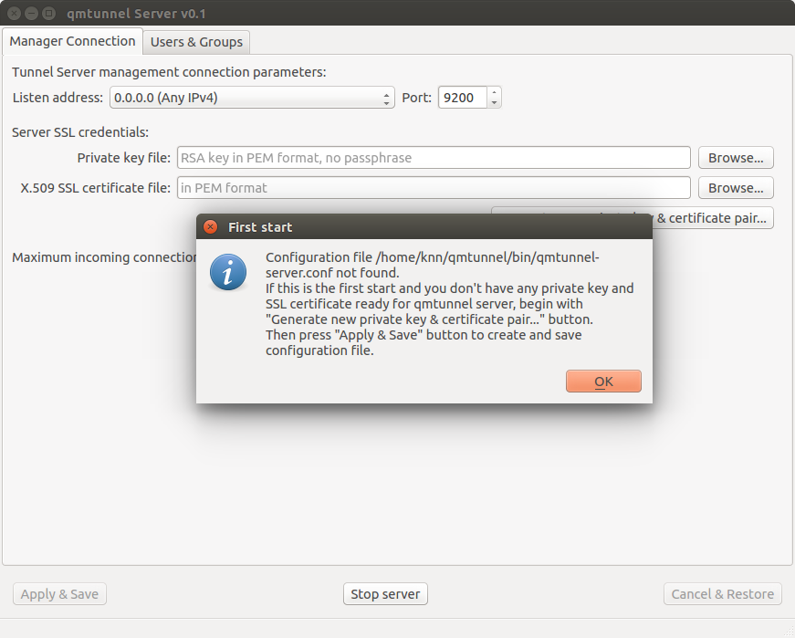

Click ``OK`` and then ``Generate new private key & certificate pair...``.

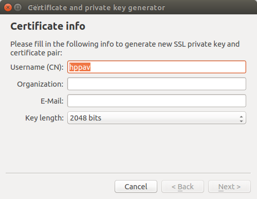

Edit ``Username (CN)`` and ``Key length`` if neccessary and press ``Next >``.

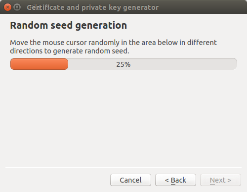

Randomly move your mouse cursor over empty space inside the wizard window to generate
better random seed. Then press ``Next >``.

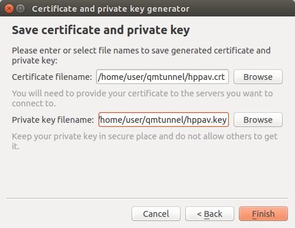

Edit file paths and press ``Finish``.

.. note:: Please ensure that you keep your private key in a safe place and do not
          give access to it to anyone except this qmTunnel server instance.

Your server private key and certificate is ready! Press ``Apply & Save`` button in
the bottom.

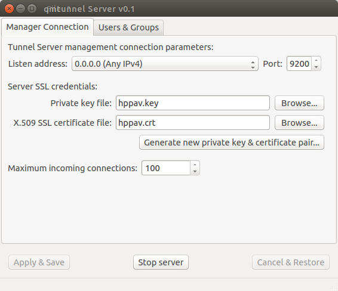

You can also change the TCP ``Port`` on which qmTunnel operates (if neccessary)
and choose specific ``Listen address`` if you don't want qmTunnel to accept
connections from all available networks.

OK, now our first qmTunnel server is up & running.

Repeat the above setup steps on at least one other host to have at least two
qmTunnel servers running. Let's suppose that the first qmTunnel server would be
at the client side, and the second one would be on destination server or network.

Setting up qmTunnel GUI
-----------------------

In order to create, modify and monitor tunnels and manage qmTunnel servers you need to run
separate application called ``qmTunnel-gui``.

When you first run ``qmtunnel-gui``, it will also ask you to set up your personal
private key and certificate which will be used to connect to and manage qmTunnel servers:

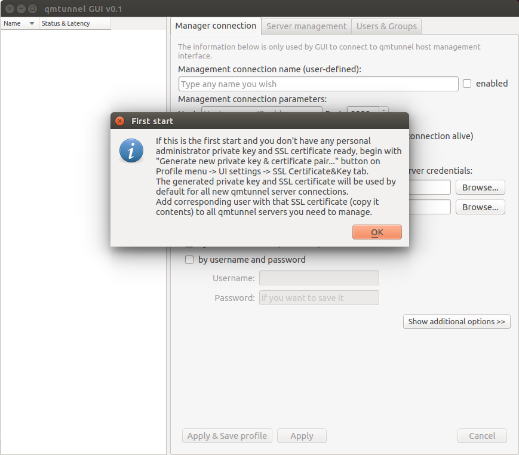

Click ``OK`` and ``User Settings`` dialog would pop up, where you can then press
``Generate new private key & certificate pair...`` button and then repeat the same
steps as for server certificate.

If you missed ``User Settings`` dialog, you can call it from main window menu ``Profile``
-> ``UI Settings...`` and then go to ``SSL Certificate&Key`` tab.

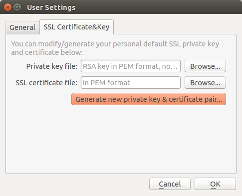

This private key and certificate will be used by default to connect to qmTunnel servers.

Connecting to qmTunnel server from GUI
--------------------------------------

qmTunnel server requires user or other server's certificate to authorize incoming connection.

Once you have created your personal certificate in ``qmtunnel-gui`` (see above),
you can copy&paste the contents of this certificate in ``qmTunnel-server``:

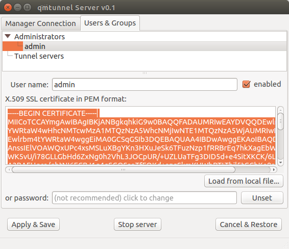

In ``qmtunnel-server`` user interface there is tab called ``Users & Groups`` which allows to manage
access to this qmTunnel server instance.

By default, there is an ``Administrators`` group with full access and one ``admin`` user
without certificate. Just select this ``admin`` user in the list and paste your personal
certificate contents into corresponding field.

Do not forget to press ``Apply & Save`` button after any modification.

OK, now return to ``qmtunnel-gui`` application.

At the left part of the main window there is a list of qmTunnel servers available. At the moment
it's empty, so right-click on this list and select ``Add tunnel server...`` from the context menu:

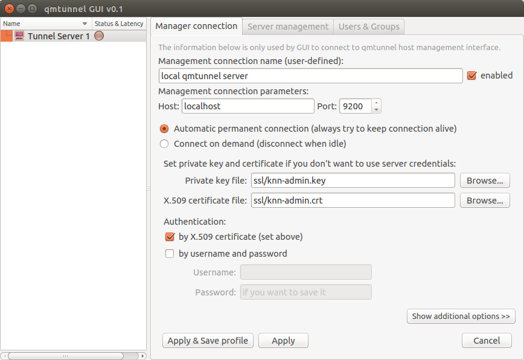

There is not much info required to enter here. Just enter something in the ``Management connection
name``, enter qmTunnel server IP-address or domain name (``localhost`` if on the same host) in
``Host`` field, and port (if changed in ``qmtunnel-server``).

There are many additional settings which are available by clicking ``Show additional options``
button, but in most cases you'll be fine with defaults.

OK, now press ``Apply & Save profile`` button and choose a file to store your profile
(qmTunnel servers list) in.

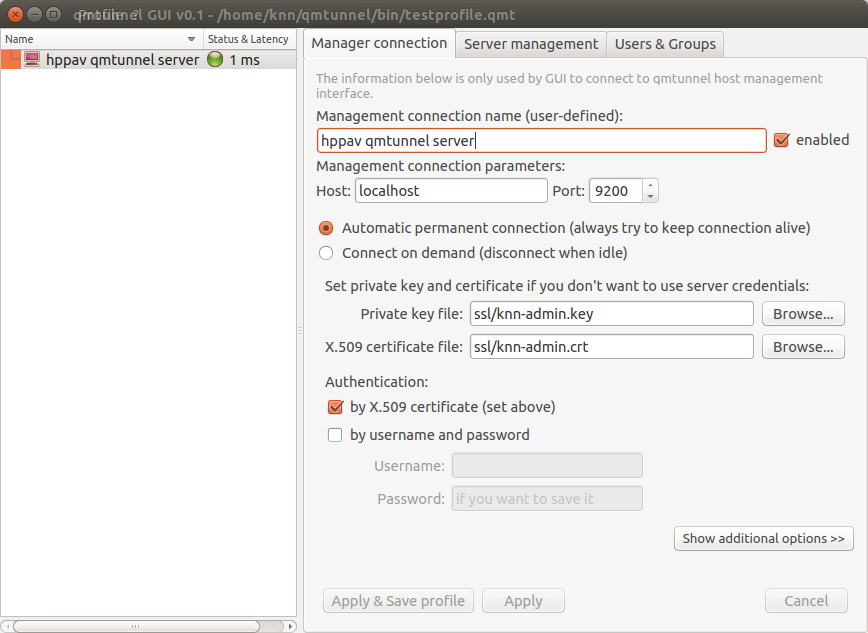

Now the green indicator shows that you have successfully connected to your first qmTunnel server.

You can now use ``qmtunnel-gui`` to configure this qmTunnel server. Use ``Server management`` and
``Users & Groups`` tabs for this purpose.

Creating tunnels from GUI
-------------------------

In order to create a tunnel, you first need to ensure that any of your qmTunnel servers "know"
previous qmTunnel server in chain.

In the current example, we need to authorize our first qmTunnel server on the second
qmTunnel server.

There is a pre-created user group called ``Tunnel servers`` which we can add our first server to:

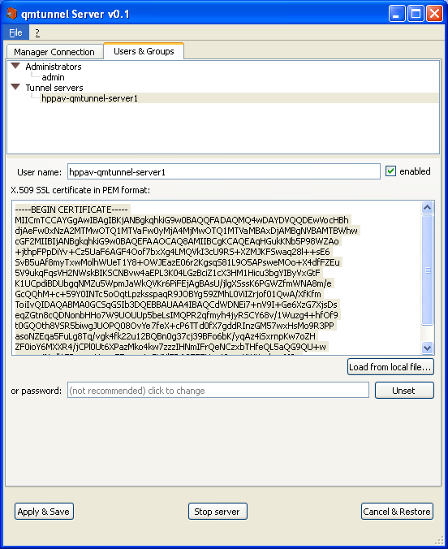

Do this on the second qmTunnel server.

To add user to the group, right-click on the group and select ``Add user...``. Specify any
user name your want, just make sure to paste correct server certificate.

Press ``Apply & Save``. Now the first qmTunnel server can connect to the second one.

Now let's create a simple local-forwarding tunnel.

Let's suppose that the second server is located in a remote network with a PostgreSQL server
we need to access like this:

.. image:: _static/schema6.png
   :align: center

Return to ``qmtunnel-gui``, right-click on our connected qmtunnel server and choose
``Create new tunnel...``:

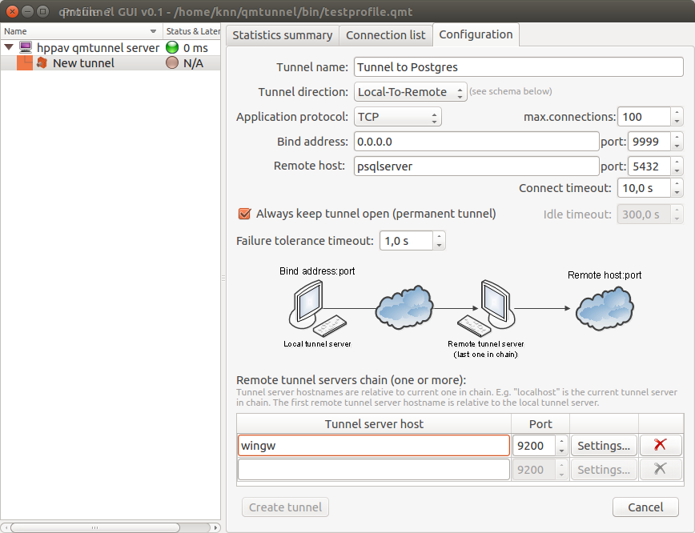

Fill up the following fields:

- **Tunnel name** - specify any tunnel name you want.
- **Bind address** - set to ``0.0.0.0`` if you want to share the tunnel with other hosts
  in your network, or ``127.0.0.1`` to make the tunnel available only from the current
  qmTunnel server host ("hppav").
- **port** (bind port) - set to any port available. ``9999`` was chosen for demonstration
  purposes. You can enter the same port as destination (5432) if it's available on
  qmTunnel host. This is the port your service/application client would connect to on
  the first qmTunnel server host.
- **Remote host** - set to IP address or domain name of destination service/application
  host. This is relative to the final qmTunnel server in chain and must be known on it.
  In the example above host "psqlserver" should be known on and available from "wingw"
  host. If you need to connect to the service/application located directly on the
  final qmTunnel host, you should enter ``localhost`` or ``127.0.0.1`` here.
- **port** (remote port) - set to final destination service/application port on
  remote host. This is where you actually want to connect to.
- **Always keep tunnel open** - Set this flag if you want this tunnel to be
  permanent and auto-reconnect when needed.
- **Remote tunnel servers chain** - add all qmTunnel servers in chain here except
  the first one. Be careful with domain/hostnames - they are also relative (should
  be known on and available from) each from previous one.

Then press the ``Create tunnel`` button.

If everything is correct, you will see green indicator for your newly created tunnel:

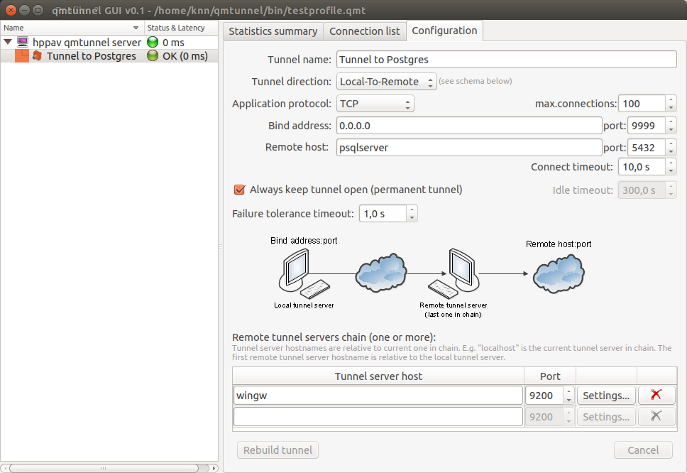

Now you can check the postgres connection to "hppav" which is transparently tunneled to
"psqlserver"::

 psql -h hppav -p 9999 -U postgres postgres

You can now also monitor tunnel activity:

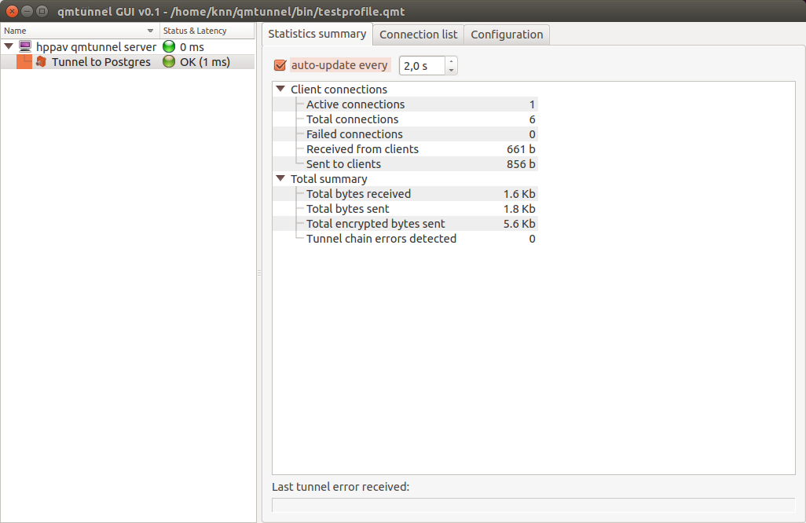

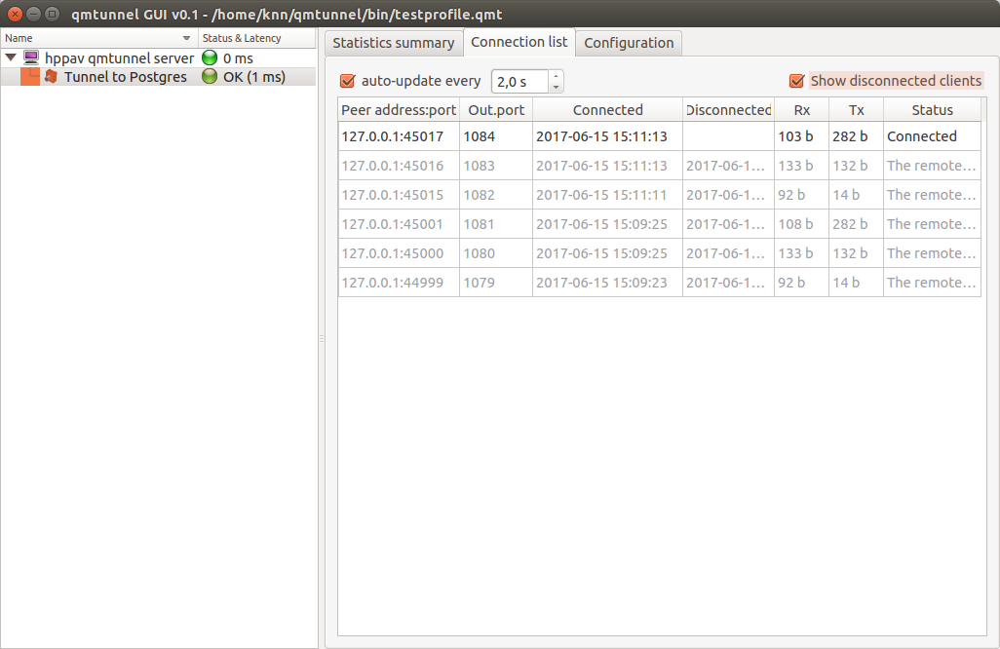

