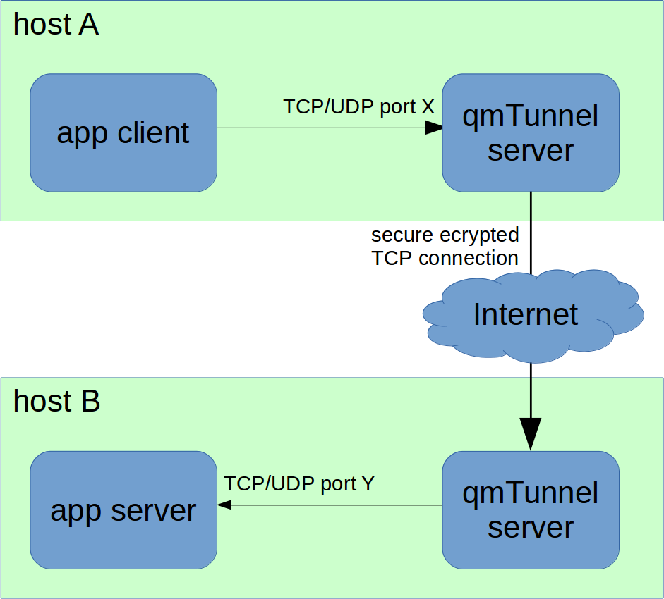
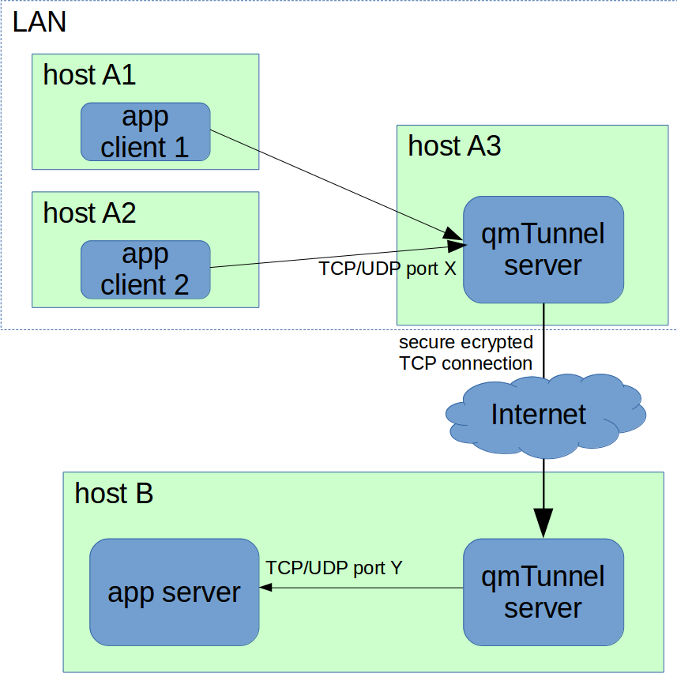
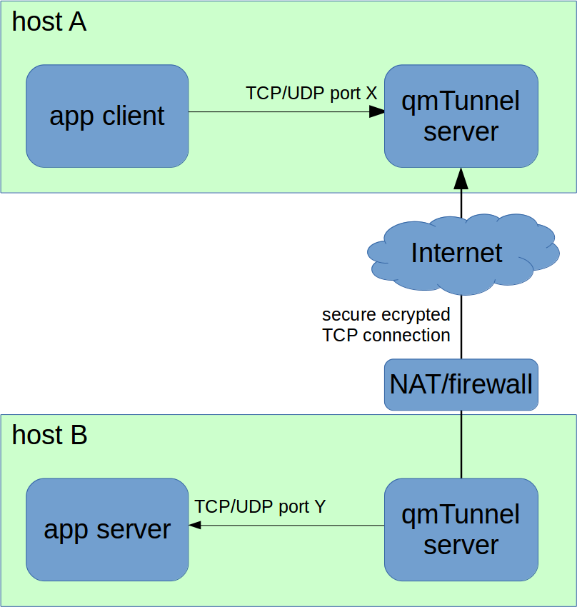
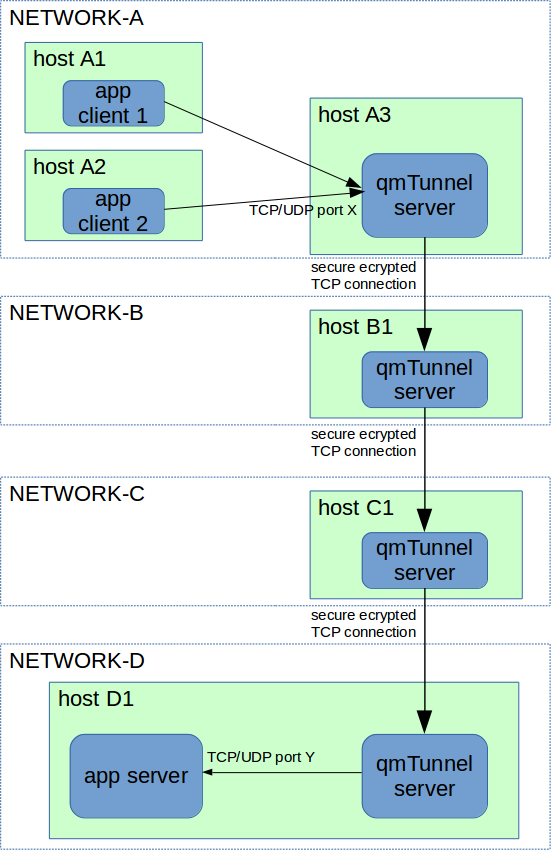

Introduction
============

qmTunnel is a free cross-platform open source tunneling software allowing you to
wrap up and tunnel all types of TCP, UDP or named pipe connections through a set
of tunnel software servers.

You may find qmTunnel useful if you need (all features are optional):

* to secure your connection with SSL/TLS;
* to connect to hosts/networks behind NAT/firewall;
* to compress your traffic;
* to detect silent packet drops and disconnections (by enabling heartbeats);
* to allow short-time disconnections between tunnel hosts with no application
  disconnections;
* to add additional authentication level to tunnel hosts;
* to automatically re-establish the tunnel on disconnections (permanent tunnel);
* to establish tunnel only when needed (on demand).

Basically your application client connects to qmTunnel server instead of connecting
directly to application server. Then qmTunnel server makes further connections to
next qmTunner server and the last qmTunnel server in chain connects to your application
server, transparently (for application client and server) transferring all application
data from application client to the application server (and vice versa) and allowing
to secure and tune the connections between qmTunnel servers.

.. _HowItWorks:

How it works
------------

The most simple case can be illustrated by the following figure:

   A simple tunnel through two hosts

When tunnel is configured on «host A», the connection is established in the following
order:

1. Application client connects to local (on the same node or network) qmTunnel server
   on specified TCP or UDP port «X» on «host A».
2. qmTunnel server on «host A» connects to qmTunnel server on «host B» and establishes
   encrypted (SSL/TLS) connection.
3. qmTunnel server on «host B» connects to local (same node or network) application
   server on specified TCP or UDP port «Y».
   *«X» might be the same as «Y», or not.*
4. All the data transmitted by the application client will be delivered through the
   tunnel to the application server and vice versa.

Application might be any application or service using TCP, UDP or Unix sockets.
For example:

* E-mail (SMTP, POP3, IMAP)
* Databases or data storages (MySQL, PostgreSQL, Oracle, SQL Server, etc.)
* Remote desktop and shell (VNC, RDP, SSH, etc.)
* DNS
* any other

In case you need to provide tunnel access to your LAN it's possible to do so:

   Providing tunnel to other hosts on the same network

It's also possible that host «B» is not available from the Internet and can't
accept incoming connections, e.g. located behind NAT/firewall or doesn't have
real IP address or domain name. In this case «remote» (or «reverse») tunnel can
help:

   Remote (reverse) tunnel

«Remote» (or «reverse») tunnel means that it's «host B» who initiates the connection
to «host A», and also the tunnel needs to be initiated on «host B» instead of «host A».

The next possible scenario is that both application client and server are behind
NAT/firewall and incoming connections can't be accepted from outside. In this case
you will need a third host acting as communication server/proxy:

.. figure:: _static/schema3.png
   :width: 600px
   :alt: Figure 4

   Using extra qmTunnel server as communication server

In this case you need to create 2 separate tunnels:

1. On «host A»: local forwarding tunnel from port «X» to «host C» port «Z».
2. On «host B»: remote forwarding tunnel from «host C» port «Z» to local port «Y».

Your tunnel's host chain length is not limited if you need to pass through a few gateways:

   Tunnel through several gateways

Architecture
------------

qmTunnel consists of 2 modules:

* **qmTunnel-server** — server module which needs to be started on all tunnel hosts
  (at least two).
  It's possible to run qmtunnel-server as GUI application or as background console
  application (use ``-daemon`` command line parameter).

* **qmTunnel-gui** — GUI which connects to qmtunnel-server instances (including remote
  ones) and allows to configure them and create/edit/monitor tunnels.

qmTunnel is a free open source cross-platform application and runs on Linux, Windows
and possibly (haven't tested yet) MacOS.

To build and run qmTunnel, you only need Qt4/Qt5 and OpenSSL libraries.

License
-------

qmtunnel is released under GNU General Public License 3.0, with the additional special
exception to link portions of this program with the OpenSSL library.
See LICENSE file for more details.

Support
-------

qmtunnel is open-source project, which means it's considered to be supported by the
community.

However if you wish to use it in production environment, commercial support is also
available from the author and maintainer of this project. Contact support@qmtunnel.com
for details. This way you can also support the project.

Copyrights
----------

Copyright (c) 2017 Nikolay N. Karikh (knn@qmtunnel.com)

LEGAL NOTICE: This product includes software developed by the OpenSSL Project for use in the OpenSSL Toolkit (http://www.openssl.org/)

Copyright (c) 1998-2017 The OpenSSL Project

Copyright (c) 1995-1998 Eric A. Young (eay@cryptsoft.com), Tim J. Hudson (tjh@cryptsoft.com)

All rights reserved.

