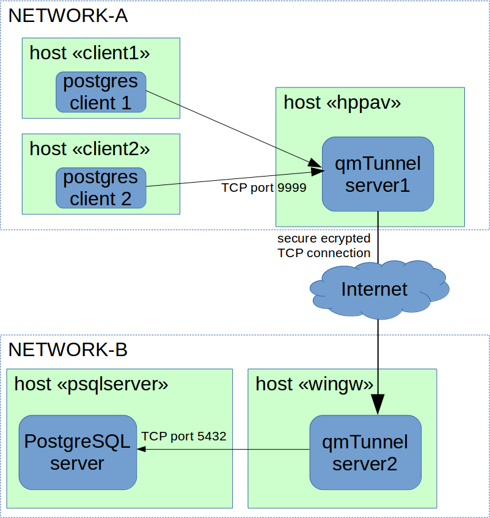

Troubleshooting
===============

If you're going to submit an issue or write to techinal support, please consider
gathering the maximum of information. See below how to do that.

Debug logs
----------

When started with ``-debug`` command line argument, both ``qmtunnel-server`` and
``qmtunnel-gui`` would write detailed log into logfile.

By default, logfile is ``qmtunnel-server.log`` and ``qmtunnel-gui.log`` correspondingly.
You can change log filename with ``-logfile FILENAME`` command line option. For example::

 ./qmtunnel-server -debug -logfile serverlog.txt

You can also limit log verbosity if you specify debug level (0 to 9)::

 ./qmtunnel-server -debug 8

Draw your schema
----------------

If you realize something is going wrong way or you have hard times understanding the
principles of forwarding and tunneling, start with drawing your network objects and
connections you'd like to establish:

It's not perfect, but it might help you to better understand what you are doing.

Include you configuration
-------------------------

``qmtunnel-server`` writes the configuration of the server to ``qmtunnel-server.conf`` file.
You can change that with ``-config`` command line argument like this::

 ./qmtunnel-server -config serverconfig.json

The config file is written in JSON format and you can easily edit it manually if needed.
You can also prepare such config file and copy it to another server if you wish.

.. note :: Config file doesn't contain any confedential information such as private keys.

           Private keys should be stored in separate files in a safe place.

Ensure you include your config files along with debug logfiles and schema when submitting
an issue.

