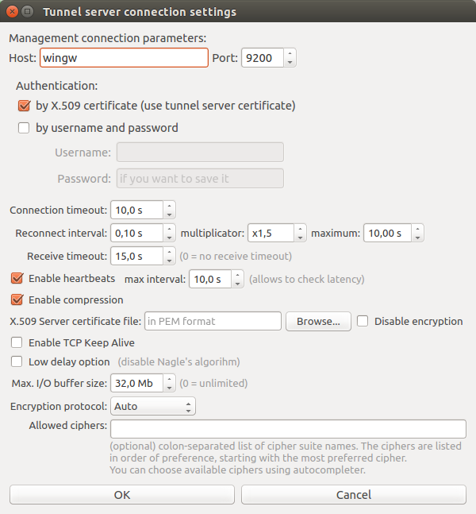

Tunnel setup
============

Tunnel settings
---------------

When creating a tunnel, you can set up the following tunnel parameters:

.. image:: _static/gui-tunnel-create1.png
   :align: center

- **Tunnel name** - specify any tunnel name you want.

- **Tunnel direction** - specify where to accept incoming connections from tunnel clients:

  * Local-To-Remote - accept incoming connections on the first tunnel server and forward
    traffic to the remote host of the last tunnel server in chain.
  * Remote-To-Local - accept incoming connections on the last tunnel server in chain and
    forward traffic to the remote host of the first tunnel server in chain.

- **Application protocol** - specify which protocol is used by the application client
  which traffic is to be forwarded.

- **max.connections** - maximum number of incoming application client connections which
  can be accepted.

- **Bind address** - set to ``0.0.0.0`` if you want to share the tunnel with other hosts
  in your network, or ``127.0.0.1`` to make the tunnel available only from the first
  (or the last in case of Remote-To-Local tunnel direction) qmTunnel server host.

- **port** (bind port) - set to any port available. You can enter the same port as
  remote destination if it's available on listening qmTunnel host. This is the port
  your service/application client would connect to on the first (or the last in case of
  Remote-To-Local tunnel direction) qmTunnel server host.

- **Remote host** - set to IP address or domain name of destination service/application
  host. This is relative to the last (or the first in case of Remote-To-Local tunnel
  direction) qmTunnel server in chain and must be known on it.
  If you need to connect to the service/application located directly on the
  qmTunnel host, you should enter ``localhost`` or ``127.0.0.1`` here.

- **port** (remote port) - set to final destination service/application port on
  remote host. This is where you actually want to connect to.

- **Connection timeout** - application client connect timeout, used by qmTunnel server
  to establish outgoing connection to the application server.

- **Always keep tunnel open** - set this flag if you want this tunnel to be
  permanent and auto-reconnect when needed.

- **Idle timeout** - if there isn't any active application client connection for this
  time interval, consider the tunnel idle and disconnect. If new incoming application
  client connects after that, automatically re-establish the tunnel ("on demand" mode).

- **Failure tolerance timeout** - if any of the tunnel servers in chain disconnects,
  do not disconnect application clients during the timeout specified and try to silently
  re-establish the tunnel.

- **Remote tunnel servers chain** - add all qmTunnel servers in chain here except
  the first one. Be careful with domain/hostnames - they are also relative (should
  be known on and available from) each from previous one.

Tunnel servers connection settings
----------------------------------

When creating a tunnel, you enter remote tunnel servers list (chain).

For every server in chain you can specify additional connection settings by pressing
corresponding ``Settings...`` button in the same line.

The following window will then pop up:

- **Connection timeout** - Connection timeout when connecting to this tunnel server.

- **Reconnect interval** - When connection fails, try to reconnect after specified
  time interval.

  **multiplicator** - Multiply current reconnect interval after each failed
  connection attempt.

  **maximum** - Maximum value of current reconnect interval.

- **Receive timeout** - Consider connection failed if no data received in this interval.
  In pair with enabled heartbeats this allows to detect TCP silent connection drops.

- **Enable heartbeats** - Send small heartbeat packets if nothing else has been sent in
  **max interval** time interval.

- **Enable compression** - Enable traffic compression. Only application-level data is
  to be compressed (and only if compressed data packet becomes smaller than uncompressed).

- **X.509 Server certificate file** - You can enter the path to qmTunnel server certificate
  file here and it will be checked after handshake. This allows to add additional security
  against MiTM attacks. Please note that at the moment this file path should be located on
  the first qmTunnel server host, so you have to edit it manually [will be fixed].

- **Encryption protocol** - Desired encryption protocol to use. Depending on Qt and OpenSSL
  version used, this may include: TLSv1.2, TLSv.1.1, TLSv.1.0, SSLv3, SSLv2. "Auto" means
  select most secure available protocol.

